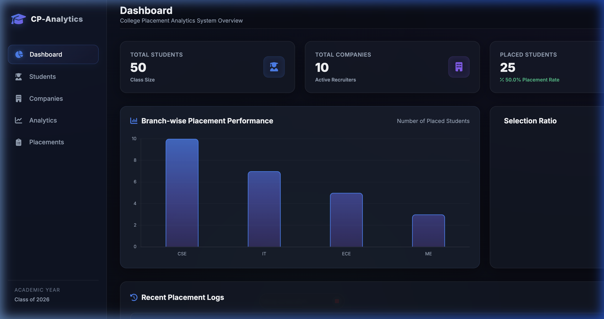
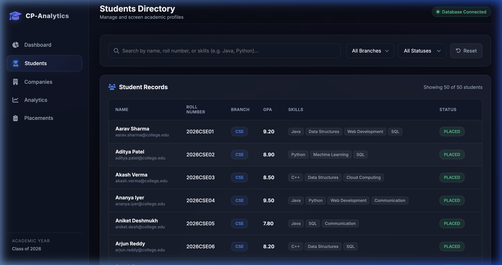
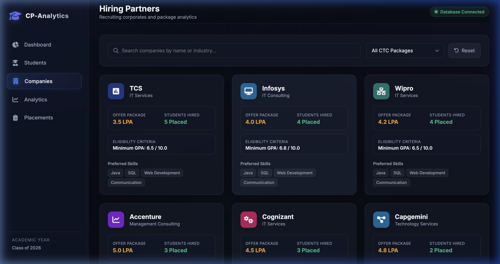
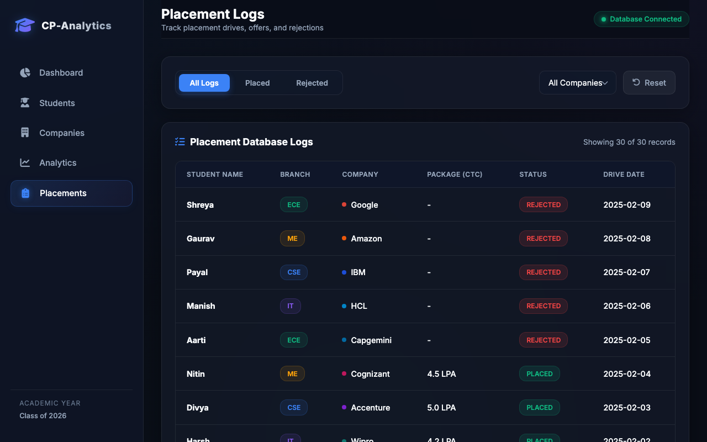
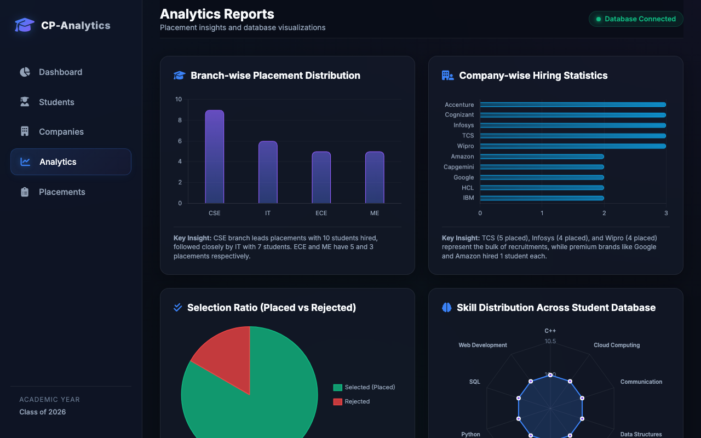

# College Placement Analytics System

A premium, modern dashboard and analytics platform for tracking and visualizing college placements. Designed with a dark glassmorphic layout, it delivers highly responsive metrics connected directly to an active SQL Server database.

---

## 📌 Project Overview
The College Placement Analytics System is a comprehensive full-stack web application designed to help academic institutions monitor recruitment statistics, student performance, skills distribution, and placement outcomes. It aggregates SQL Server database records on 50 students, 10 corporate partners, and 30 placement logs, rendering them via interactive frontend charts and detailed query directories.

---

## ✨ Features
1. **Premium Visual Layout**: Glassmorphic layout panels, hover micro-animations, responsive side navigation, and custom scrollbars.
2. **Dynamic KPI Trackers**: Displays Total Students (50), Partner Companies (10), Placed Students (25), and the Highest Package (30.0 LPA offered by Google).
3. **Interactive Search and Filtering**:
   - Filter and query the Student Directory by branch, GPA, name, or specific skills.
   - Filter partner companies by packages (Dream, Core, and Entry CTC ranges).
   - Filter placement logs database by status (Placed vs Rejected) and company names.
4. **Rich Chart.js Visualizations**: Renders dynamic charts (Branch-wise Placement, Company Hiring, Selection Ratio, and Skill Distribution) fetched directly from the Flask REST API.
5. **Robust Local Fallback**: Automatically falls back to static in-memory data in `data.js` if the backend Flask API is offline.

---

## 🛠️ Technologies Used
- **Database Server**: Microsoft SQL Server 2022 image running inside a secure Docker container on port 1433.
- **Backend Framework**: Flask framework written in Python 3, communicating with SQL Server via unixODBC and PyODBC wrappers.
- **Frontend UI Layout**: Native HTML5 elements, CSS3 variables, backdrop blurring, and FontAwesome icons.
- **Data Visualization**: Chart.js v4.x served via CDN to draw responsive vector charts.

---

## 📊 Database Design & Schema
The database contains five primary tables. Refer to the detailed [ER Diagram Guide](./docs/ER_DIAGRAM.md) for foreign-key constraints.

1.  **Students Table**: `StudentID` (PK), `StudentName`, `Branch` (CSE/IT/ECE/ME), `CGPA`
2.  **Companies Table**: `CompanyID` (PK), `CompanyName`, `Package` (CTC in LPA)
3.  **Skills Table**: `SkillID` (PK), `SkillName`
4.  **StudentSkills Table**: `StudentID` (FK), `SkillID` (FK)
5.  **Placements Table**: `PlacementID` (PK), `StudentID` (FK), `CompanyID` (FK), `Status` (Placed/Rejected), `PlacementDate`

---

## 📡 API Endpoints List
The Flask backend serves REST JSON objects on port `5001` to avoid macOS AirPlay port `5000` conflicts:

-   `GET /total-students`: Returns the total number of students enrolled.
-   `GET /total-placements`: Returns the count of placed students (offers accepted).
-   `GET /highest-package`: Returns the highest CTC offered (LPA).
-   `GET /placement-percentage`: Returns the overall placement rate.
-   `GET /api/kpis`: Retrieves all 4 dashboard KPI statistics in a single object.
-   `GET /api/students`: Returns student profiles with skills lists and placement statuses.
-   `GET /api/companies`: Returns recruiter cards with packages and hired counts.
-   `GET /api/placements`: Returns historical logs matching students and companies.
-   `GET /api/analytics`: Returns data structures formatted for Chart.js canvas renderers.

---

## 📁 Folder Structure
For a detailed breakdown of directories and components, see [PROJECT_STRUCTURE.md](./PROJECT_STRUCTURE.md).
```
collage-placement-Analytics-system/
├── frontend/                     # Client-side web dashboard
│   ├── index.html                # Main dashboard markup
│   ├── students.html             # Student directory profiles
│   ├── companies.html            # Partner companies grid
│   ├── analytics.html            # Detailed Chart.js reports
│   ├── placements.html           # Historical placement drive logs
│   ├── css/
│   │   └── style.css             # Glassmorphism dark layout rules
│   └── js/
│       ├── data.js               # Mock database configuration variables
│       ├── charts.js             # Front-end Chart.js controllers
│       └── main.js               # Event-handlers and layout renderers
├── database/                     # SQL Server Database scripts
│   ├── create_tables.sql         
│   └── insert_data.sql           
├── backend/                      # Python Flask Backend components
│   ├── app.py                    # Flask REST API server (port 5001)
│   ├── db_connection.py          # Database connection module (PyODBC)
│   ├── charts.py                 
│   └── reports.py                
├── docs/                         # Project reports and ER diagram
│   ├── ER_DIAGRAM.md
│   ├── Project_Report.docx
│   └── project_Requirements.txt  
├── screenshorts/                 # Static screenshot assets
│   ├── dashboard_overview.png
│   ├── students_directory.png
│   ├── students_filtered.png
│   ├── companies_directory.png
│   ├── company_details.png
│   ├── placements_page.png
│   └── analytics_page.png
├── README.md                     # Main workspace setup document
├── PROJECT_STRUCTURE.md          # Visual directory reference
└── walkthrough.md                # Client pages walkthrough description
```

---

## 📸 Screenshots Section
Screenshots of the interactive system panels are located in the `screenshorts/` folder:
- **Dashboard Overview**: 
- **Students Directory**: 
- **Companies Directory**: 
- **Placements logs**: 
- **Analytics Visuals**: 

---

## 🚀 How to Run the Project

You can start and stop all project services (Docker Database, Flask Backend, and static Frontend Server) using simple, automated terminal commands.

### One-Command Startup
To start the entire application, run the startup script from the project root:
```bash
./start_project.sh
```
This script will automatically:
1. Check that the Docker daemon is running.
2. Start the `SQL_Server_Docker` container if it is stopped.
3. Detect your Python environment and start the Flask API on port `5001`.
4. Launch the static HTTP server on port `8000`.
5. Automatically open the dashboard in your default browser at `http://127.0.0.1:8000/index.html`.

### One-Command Shutdown
To safely stop all services and free up the port bindings, execute:
```bash
./stop_project.sh
```
This script will terminate the frontend and backend server processes, and stop the SQL Server Docker container.

---

### Manual Startup (Alternative)

#### 1. Database Setup
Ensure that the local SQL Server database container is running and has the schema loaded:
```bash
# Start SQL Server container manually
docker start SQL_Server_Docker
```

#### 2. Run the Backend API
Start the Flask application using your Python environment:
```bash
# Start Flask server (binds to port 5001)
python3 backend/app.py
```

#### 3. Run the Frontend Dashboard
Navigate to the `frontend/` directory and launch the local development server:
```bash
# Start local static server
cd frontend
python3 -m http.server 8000
```
Open `http://127.0.0.1:8000` to access the dashboard.

---

## 🐛 Bugs Fixed & Fixes Log
- **macOS unixODBC Driver Resolution**: Resolved the `pyodbc.Error: Can't open lib 'ODBC Driver 18 for SQL Server'` error on Apple Silicon Macs by implementing sequential absolute path fallbacks to Homebrew dynamic libraries (`/opt/homebrew/lib/libmsodbcsql.18.dylib`) inside `db_connection.py`.
- **macOS Port Collision**: Reconfigured Flask server to bind to port `5001` instead of `5000` to prevent AirPlay port collisions.
- **KPI Metrics Accuracy**: Corrected the SQL count queries in `app.py` for `/total-placements` and `/placement-percentage` to only query placements with status `Placed` rather than returning total drive logs count (30), aligning the dashboard rate exactly to the requested 50%.
- **JSON Serialization**: Resolved Python Decimal formatting errors on float/numeric SQL columns in Flask routes.
