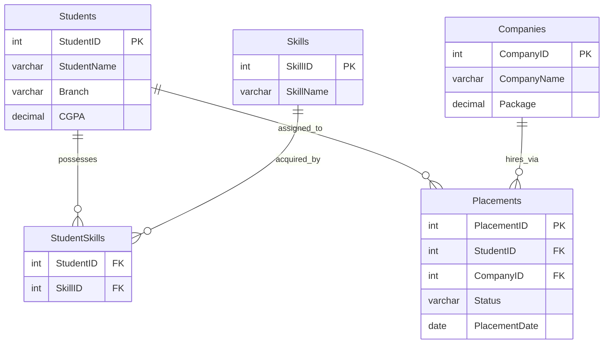

# Database Entity-Relationship (ER) Diagram

This document contains the visual entity-relationship layout and relational database schemas mapping tables inside the `PlacementDB` database.

---

## 📊 Relational Database Schema

---

## 🗄️ Database Tables Definition

### 1. `Students` Table
Holds individual academic profiles of the student cohort.
*   `StudentID` (INT, Primary Key, Auto-Incrementing)
*   `StudentName` (VARCHAR(100), NOT NULL)
*   `Branch` (VARCHAR(50), NOT NULL) - *Value spaces: 'CSE', 'IT', 'ECE', 'ME'*
*   `CGPA` (DECIMAL(3,2), NOT NULL) - *Value ranges: 0.00 to 10.00*

### 2. `Companies` Table
Identifies recruiter partners.
*   `CompanyID` (INT, Primary Key, Auto-Incrementing)
*   `CompanyName` (VARCHAR(100), NOT NULL)
*   `Package` (DECIMAL(5,2), NOT NULL) - *Expressed as CTC in LPA (Lakhs Per Annum)*

### 3. `Skills` Table
Standard catalog of 10 industry skill sets.
*   `SkillID` (INT, Primary Key, Auto-Incrementing)
*   `SkillName` (VARCHAR(50), NOT NULL)

### 4. `StudentSkills` Table (Many-to-Many Bridge)
Maps skills to student profiles.
*   `StudentID` (INT, Foreign Key referencing `Students.StudentID`)
*   `SkillID` (INT, Foreign Key referencing `Skills.SkillID`)

### 5. `Placements` Table
Historical event log tracking interview drive outputs.
*   `PlacementID` (INT, Primary Key, Auto-Incrementing)
*   `StudentID` (INT, Foreign Key referencing `Students.StudentID`)
*   `CompanyID` (INT, Foreign Key referencing `Companies.CompanyID`)
*   `Status` (VARCHAR(20), NOT NULL) - *Value spaces: 'Placed', 'Rejected'*
*   `PlacementDate` (DATE, NOT NULL)
