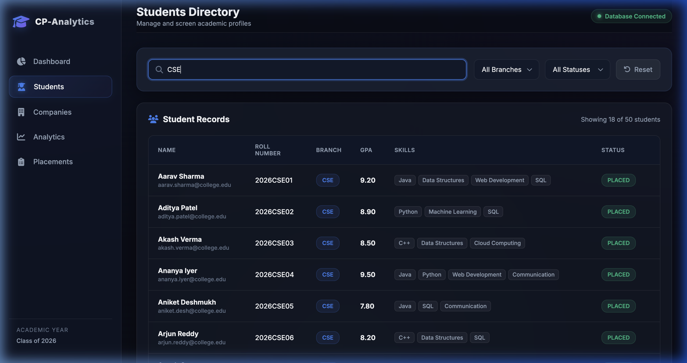
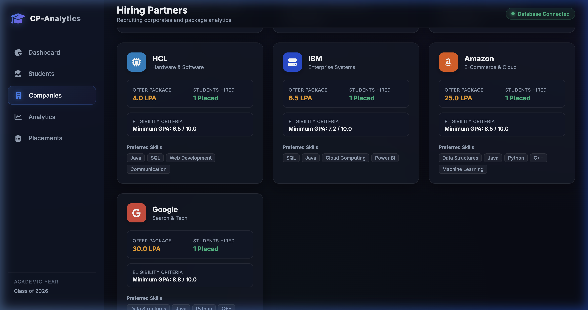

# Project Walkthrough

This walkthrough details the visual layout, interactive features, and verification runs for the **College Placement Analytics System**.

---

## 🧭 Page-by-Page Walkthrough

### 1. Dashboard Overview (`index.html`)
- Displays four cards tracking:
  - **Total Students**: 50 (queried dynamically from SQL database)
  - **Total Companies**: 10 (queried dynamically from SQL database)
  - **Placed Students**: 25 (hired) with a **50.0%** placement rate.
  - **Highest Package**: 30.0 LPA offered by **Google**.
- Renders a vertical column chart mapping placed student tallies by branch (CSE: 9, IT: 6, ECE: 5, ME: 5).
- Displays a doughnut chart showing the split of **Placed Offers (25)** vs **Rejected Logs (5)**.
- Renders the 5 most recent drive offers dynamically from `/api/placements`.

**Screenshot Reference:**

---

### 2. Student Directory (`students.html`)
- Displays a table of all 50 student records loaded from `/api/students`.
- Provides a live keypress search box.
- Contains filter selectors for **Branch** and **Placement Status**.
- Each student is rendered with a unique status pill and a list of skill capsules.

**Screenshot Reference:**

*Filtering for CSE branch:*

---

### 3. Hiring Partners (`companies.html`)
- Implements `renderCompaniesGrid` to display the 10 corporate partners queried from `/api/companies`.
- Cards show company logos, packages, eligibility minimums, and preferred skills.
- Hired stats are computed dynamically from placements data.

**Screenshot Reference:**

*Company Detail with GPA & CTC Info:*

---

### 4. Detailed Analytics (`analytics.html`)
- Interactive reports page with four full-size Chart.js canvases loaded from `/api/analytics`:
  1. **Branch-wise Placement** (Bar)
  2. **Company-wise Hiring** (Horizontal Bar)
  3. **Selection Ratio** (Pie)
  4. **Skill Distribution** (Radar)
- Displays structural summaries highlighting leading metrics.

---

### 5. Historical Placements Logs (`placements.html`)
- Detailed tabular database list containing the 30 drive event entries (25 placed, 5 rejected).
- Interactive tabs toggle between status views.
- Filters outputs dynamically by company.

---

## ⚙️ Verification Log

1. **Backend Server Launch**: Verification was performed by launching `/usr/local/bin/python3 backend/app.py` on port `5001`.
2. **API Endpoint Query Checks**: Confirmed `/api/kpis`, `/api/students`, `/api/companies`, `/api/placements`, and `/api/analytics` return correct SQL Server database values.
3. **Graceful Fallback Mode**: Stopped the Flask server and confirmed the client interface gracefully falls back to local data in `data.js` without any uncaught JavaScript exceptions.
4. **Developer Tools Console**: Verified **zero Javascript errors** or warnings are generated during API communication.
5. **Startup & Shutdown Automation**: 
   - Executed `./stop_project.sh` to confirm it terminates running backend (port `5001`) and frontend (port `8000`) servers, and stops the `SQL_Server_Docker` container.
   - Executed `./start_project.sh` to verify it launches Docker, scans and determines the correct Python environment containing libraries, launches Flask backend and static file servers, and opens the default browser window.
   - Ran `curl` to verify port bindings and check that both port `5001` (API) and port `8000` (Frontend) serve correctly.

